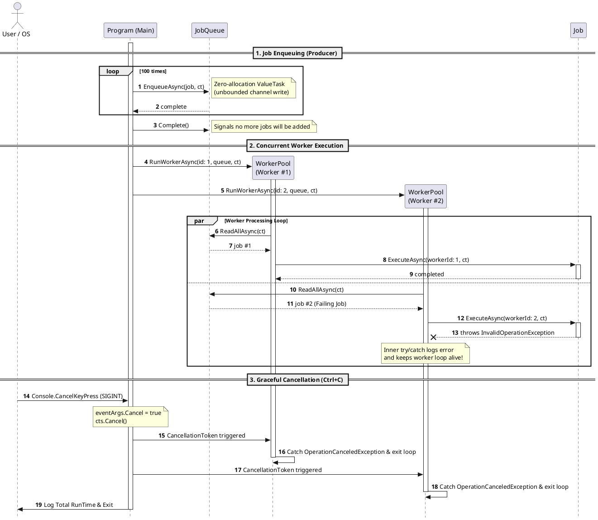

# MiniJobQueue

A minimal, zero-dependency, in-memory job queue built with C# and .NET 10. Demonstrates the **Producer-Consumer** pattern using `System.Threading.Channels` and async streams.

## Features

- Thread-safe async queue via `System.Threading.Channels`
- Configurable worker pool with concurrent job execution
- Graceful shutdown via `CancellationToken` (Ctrl+C)
- Per-job error handling — one bad job doesn't crash the workers
- Zero-allocation `ValueTask` writes
- Color-coded, thread-safe console logging
- Deliberate failure injection for demonstration purposes

## Prerequisites

- [.NET 10.0 SDK](https://dotnet.microsoft.com/download)

## Build & Run

```bash
# Build
dotnet build

# Run
dotnet run --project MiniJobQueue/MiniJobQueue.csproj
```

Press **Ctrl+C** at any time to trigger graceful cancellation.

## Project Structure

```
MiniJobQueue/
├── Program.cs       # Entry point — seeds jobs, starts workers, handles shutdown
├── Job.cs           # Immutable job entity with ExecuteAsync
├── JobQueue.cs      # Thread-safe channel-based queue (producer API)
├── WorkerPool.cs    # Consumer loop — pulls jobs and executes them
└── Logger.cs        # Thread-safe, color-coded console logger
```

## Architecture Sequence Diagram



## How It Works

1. **Producer** — `Program.SeedJobsAsync` enqueues 100 jobs into the channel. Every 25th job is a `"Failing Job"` that deliberately throws on execution.
2. **Workers** — Two workers run concurrently. Each iterates over the async stream (`await foreach`) and executes jobs as they become available.
3. **Cancellation** — Pressing Ctrl+C triggers a `CancellationToken`, causing workers to catch `OperationCanceledException` and exit their loops cleanly.

## Design Decisions

| Decision | Rationale |
|---|---|
| `System.Threading.Channels` over `BlockingCollection<T>` | Modern async-first API; integrates naturally with `await foreach` |
| Unbounded channel | Simplicity; no backpressure needed for a demo |
| `ValueTask` on `EnqueueAsync` | Unbounded channel writes complete synchronously — avoids heap allocation |
| Immutable `Job` properties | Safer for concurrent access; no accidental mutation |
| Per-worker try/catch | Fault tolerance — one bad job doesn't terminate the worker |
| `IAsyncEnumerable<T>` over `.Reader` directly | Encapsulates channel internals; exposes a clean domain abstraction |
